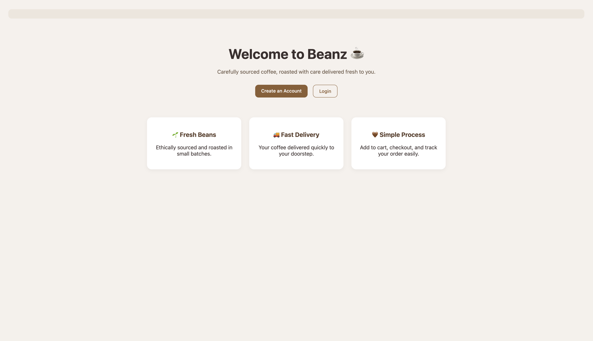
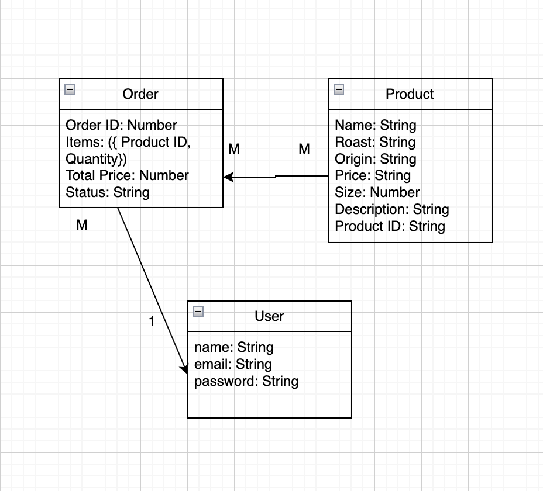

--I called the app Beanz since it mainly sells roasted coffee beans, so i thought it would be a fitted and simple catchy name, the app is fullstack CRUD which uses MongoDb, Express and Node.js, i built it specifically because a friend of mine is starting a coffee beans business, so i thought i can add on it in the future for a proper use.

--Deployed App
in progress

--Planning Materials
 --> this was my inital diagram, lots opf changes happened during the process and i wish i used notion or trello to have evreything planned, i relyed on the daily goals instaed

--Technologies Used
- JavaScript
- Node.js
- Express
- MongoDB
- Mongoose
- EJS
- express-session
- CSS

--Next Steps:
1. have proper ejs pages for each user and the admin
2. style it better 
3. add more functionalities like email or order tracking
4. have an automatically data graph gemerated for the admin to track orders/profit
5. add user profile editing